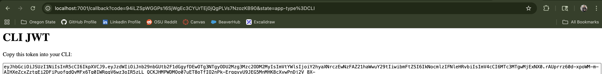

# CS 361 Team 16 - Microservice 3 (Small Pool) & 4-5 (Large Pool)

### Description
- Three microservices in repository:
    - Backend VerifyJWT *(in pogress - large pool)*
        - Verifies Authenticity - Verify JWT tokens
    - Backend Redis *(in pogress - large pool)*
        - JWT Cache Logout - Cache JWT tokens
    - Backend Auth0 (Small Pool)
        - Proves Identity - authenticate user to database
        - Creates Authenticity - Create JWT tokens
        - Verifies Authenticity & Identity *(for now)*
            - Verify JWT - proves authenticity (granular would be roles as well)
            - id inside JWT proves identity

### Group Communication Contract
- Discord is where we will communicate.
- We are expected to respond to messages within 24 hours.
- A backup plan for microservices will go into effect if a team member has become unresponsive for over 72 hours.
- We won’t dismiss/mock anybody’s questions.
- We will be patient with one another.

# NOTES
### Backend VerifyJWT Microservice - Large Pool
### Backend Redis Microservice - Large Pool
### Backend Auth0 Microservice - Small Pool

How to request data from the microservice:
- Applications *Note:* BACKEND_URL = `http://localhost:7001/`:
    - Web
        - To request a specific URL to login into the Web Auth0 client, render/go to `{BACKEND_URL}/login?app-type=Flask` in the browser
        - To verify JWT, send cookie named `jwt_calorie_counter_profile` inside GET request with the JWT and go to `{BACKEND_URL}/verify-user`
            - Check if `success` is True, otherwise it was not successful
    - CLI
        - To request a specific URL to login into the Web Auth0 client, click to `{BACKEND_URL}/login?app-type=CLI` in the CLI
        - To verify JWT, send raw JWT inside header in GET request with the JWT and send GET request to `{BACKEND_URL}/verify-user`
            - Check if `success` is True, otherwise it was not successful

Example call for requesting data:
- Applications *Note:* BACKEND_URL = `http://localhost:7001/`:
    - Web
        - `return redirect(f"{BACKEND_URL}/login?app-type=Flask")`
        - `resp = requests.get(f"{BACKEND_URL}/verify-user", headers=headers)`
            - First do:
                - `token = request.cookies.get("jwt_calorie_counter_profile")`
                - `headers = {"Authorization": token}`
    - CLI
        - Click from CLI `{BACKEND_URL}/login?app-type=Flask`
        - `resp = requests.get(f"{BACKEND_URL}/verify-user", headers=headers)`
            - First do:
                - `app = self.get_app()`
                - `inp = event.input # What the user inputted`
                - `raw = inp.value.strip()`
                - `headers = {"Authorization": raw}`

How to receive data from the microservice:
- Applications
    - Web
        - Data is returned via HTTP route to the microservice endpoint at frontend URL `/calorie-counter/home`
            - Extract cookie to get JSON data inside `request.cookies.get("jwt_calorie_counter_profile)`
        - Data is returned via GET request, extract JSON data inside `.json`
    - CLI
        - Collect JWT key in browser via http page
        - Data is returned via GET request, extract JSON data inside `.json`

Example call for receiving data:
- Applications
    - Web
        - At route `/calorie-counter/home`, do `token = request.cookies.get("jwt_calorie_counter_profile")`
        - At route `/calorie-counter/home`, do:
            - `resp = requests.get(f"{BACKEND_URL}/verify-user", headers=headers)`
            - `user_info = resp.json().get("user_info")`
    - CLI
        - 
        - After requesting `headers = {"Authorization": raw}` and `resp = requests.get(f"{BACKEND_URL}/verify-user", headers=headers)`:
            Extract: `user_info = resp.json().get("user_info")`

UML sequence diagram:

UML Diagram Description:

- Frontend:
    - Type URL for homepage to login (Web)
        - Homepage is redirected to `/login` (Web)
            - `/login` redirects to backend `/login` (Web)
    - Click link redirects to backend /login (CLI)

- Backend `/login` (CLI or Web):
    - Finds the application system type the user is coming from (`CLI` = CLI, `Flask` = Web)
    - Creates a URL and the user is redirected to Auth0's login page for the specific app system type and asks the user to login into Auth0's identity database
        - Each database holds its own login records
        - User can login or create an account
    - User is logged in and sent to the backend's database's `/callback`

- Backend `/callback` (CLI or Web):
    - Backend server receives auth code from auth0 via URL
        - The Auth code is a 1 time usable code to establish an access token with Auth0
    - Auth code is exchanged for access token from Auth0
    - The access token is used to get user information
        - Access token is then lost in code (for good reason) after user info is retrieved
    - Establishes a JWT: 
        - Method 1 (used): Private/Public JWT
            - Private key is used to encode JWT
            - User info is stored into JWT
        - Method 2 (not used): Shared JWT method 
            - Not appliceable here since it is talking from frontend to backend, and not two backend systems
    - To return to frontend:
        - Returns to the frontend URL's homepage for the user's login with JWT inside the cookie (Web)
        - Returns to a browser with the JWT private/public token (CLI)

- Frontend:
    - Retrieves cookie from webbrowser and renders homepage (Web)
    - Enters JWT in CLI and keeps saved in session (CLI)
    - Each new page requiring login verification, each system (CLI or Web) calls backend `/verify-user`

- Backend `/verify-user` (CLI or Web):
    - Checks if JWT exists in JSON body
        - Uses `public.pem` key to verify JWT
    - Verifies and sends back user info in JSON body
        - Frontend could do this but is done on the backend

- Logout:
    - Save over old cookie jwt as a new cookie, with it expiring immediately (Web)
    - Remove saved JWT (CLI)
    - Directs user to login page (CLI & Web)

In depth Diagram for Microservice:

# Additional Notes
- Additional cookie, JWT, and Flask documentation can be found on READme at [Calorie Tracker READme](https://github.com/chrisbuild124/Calorie-Tracker/blob/main/README.md)
- Additional CLI docuemntation can be found at [CLI Repository](https://github.com/quetzlcoatlus/project-repository)

### Group Members
- Alexander Lane
- Gregory Preiss
- Christopher Sexton

### Repo-Contributors 
- Alexander Lane
- Christopher Sexton

### Repo-Users
- Alexander Lane
- Christopher Sexton